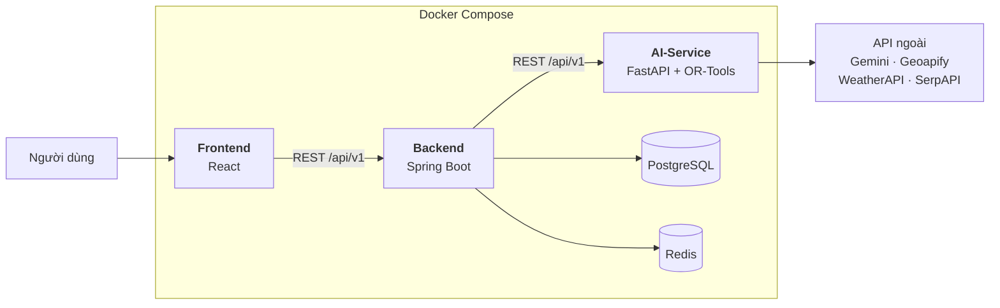

# Loko — Hệ thống lập kế hoạch du lịch tự động

Loko nhận vào điểm đến, số ngày, sở thích và nhóm đi cùng của người dùng, rồi **tự sinh
lịch trình chi tiết theo từng khung giờ** cho cả chuyến đi — chứ không chỉ gợi ý một danh
sách địa điểm.

Bài toán lõi được mô hình hoá thành **Vehicle Routing Problem with Time Windows (VRPTW)**
và giải bằng **Google OR-Tools**: mỗi ngày là một tuyến đường xuất phát và kết thúc tại
khách sạn, mỗi địa điểm có giờ mở/đóng cửa, thời gian tham quan riêng, và một "điểm ưu
tiên" tính từ đánh giá cộng với sở thích người dùng.

> Đồ án môn **Tư duy tính toán** — Trường ĐH Khoa học Tự nhiên, ĐHQG-HCM.
> Nhóm 6 thành viên, 10/2025 – 12/2025.

---

## Mục lục

- [Tính năng](#tính-năng)
- [Kiến trúc](#kiến-trúc)
- [Công nghệ](#công-nghệ)
- [Thuật toán lập lịch](#thuật-toán-lập-lịch)
- [Chạy dự án](#chạy-dự-án)
- [Biến môi trường](#biến-môi-trường)
- [Kiểm thử](#kiểm-thử)
- [Cấu trúc thư mục](#cấu-trúc-thư-mục)
- [API chính](#api-chính)
- [Cơ sở dữ liệu](#cơ-sở-dữ-liệu)

---

## Tính năng

| Nhóm | Mô tả |
|---|---|
| Tài khoản | Đăng ký / đăng nhập JWT (access + refresh token), xác thực email bằng mã OTP, quên & đổi mật khẩu |
| Hồ sơ | Sở thích du lịch (hobby), ảnh đại diện, gói thường / premium |
| Lập kế hoạch | Sinh lịch trình nhiều ngày theo 8 phong cách chuyến đi, có xét trẻ em / người lớn tuổi |
| Tinh chỉnh | Tạo lại **một phần** lịch trình (từ chối vài điểm) hoặc **toàn bộ**, có giới hạn số lượt |
| Chuyến đi | Theo dõi tiến độ, đánh dấu hoàn thành, lịch sử chuyến đi, xuất lịch trình ra PDF |
| Khám phá | Đánh giá địa điểm, bản đồ tỉnh thành đã đi qua, thời tiết theo ngày |

8 phong cách chuyến đi, mỗi phong cách là một solver riêng với bộ ràng buộc khác nhau:
`adventure` · `amusement` · `food` · `history` · `honeymoon` · `nightlife` · `photograph` · `vacation`

---

## Kiến trúc



Vai trò từng service:

- **Frontend** — giao diện người dùng, bản đồ tỉnh thành, màn hình chỉnh sửa lịch trình.
- **Backend** — nguồn sự thật về dữ liệu: người dùng, địa điểm, chuyến đi, đánh giá.
  Chịu trách nhiệm xác thực, phân quyền, xuất PDF, và điều phối các lời gọi sang AI-Service.
  Redis làm cache tầng service qua Spring Cache (`@Cacheable` cho danh sách địa điểm
  nổi bật theo tỉnh và cho chi tiết chuyến đi).
- **AI-Service** — toàn bộ phần tính toán: gắn tag địa điểm bằng LLM, lấy ma trận thời
  gian di chuyển, và giải bài toán xếp lịch.

---

## Công nghệ

| Tầng | Công nghệ |
|---|---|
| Frontend | React 18, React Router, MUI, Leaflet + react-simple-maps (bản đồ), Axios |
| Backend | Java 21, Spring Boot 3, Spring Security, Spring Data JPA, JJWT |
| AI-Service | Python 3.13, FastAPI, **Google OR-Tools**, Google Gemini |
| Dữ liệu | PostgreSQL 17, Redis |
| Hạ tầng | Docker, Docker Compose |
| API ngoài | Geoapify (route matrix), Gemini (gắn tag & sinh mô tả), WeatherAPI, SerpAPI |

---

## Thuật toán lập lịch

Mỗi **ngày** trong chuyến đi là một bài toán VRPTW độc lập, một "xe" xuất phát từ khách sạn
(node `0` — depot).

**1. Chuẩn bị dữ liệu**

- Địa điểm được crawl rồi **gắn tag bằng Gemini** (`app/services/tagging_service.py`),
  ví dụ `restaurant`, `night market`, `museum`, `viewpoint`.
- **Ma trận thời gian di chuyển** lấy từ Geoapify Route Matrix
  (`app/services/matrix_service.py`). API giới hạn 1000 phần tử mỗi request nên ma trận
  được chia lô theo hàng trước khi ghép lại.

**2. Dựng mô hình** (`app/services/schedule_service.py::_create_instance`)

| Thành phần mô hình | Ý nghĩa trong bài toán thực tế |
|---|---|
| `time_matrix[i][j]` | Thời gian đi từ điểm `i` sang `j` (phút) |
| `service_time[i]` | Thời gian dừng lại tham quan tại `i`, phụ thuộc loại địa điểm |
| `time_windows[i]` | Giờ mở – đóng cửa, quy về phút kể từ lúc bắt đầu ngày |
| `penalties[i]` | **Cái giá phải trả nếu bỏ qua điểm `i`** — càng cao càng đáng đi |
| `lunch_nodes` / `night_nodes` | Các điểm ăn uống / vui chơi đêm cần ràng buộc khung giờ riêng |

`penalties` chính là cơ chế xếp hạng: điểm gốc tính từ `average_rating`, rồi nhân hệ số
theo sở thích người dùng (`×6`), theo loại hình (quán ăn `×12`), và giảm mạnh với những
điểm người dùng **đã đi** (`×0.01`) hoặc **đã từ chối** (`×0.05`) — nhờ vậy tính năng
"tạo lại lịch trình" không lặp lại các điểm cũ.

**3. Ràng buộc** (`app/solvers/base_solver.py`)

- `AddDimension("Time", slack_max=60, capacity=max_duration)` — cộng dồn thời gian
  di chuyển + tham quan; chờ tối đa 60 phút tại mỗi điểm; tổng không vượt độ dài ngày.
- `CumulVar(i).SetRange(start, end)` — ràng buộc **cứng** cho giờ mở/đóng cửa.
- `AddDisjunction([i], penalty[i])` — cho phép **bỏ** điểm không kịp giờ thay vì để cả
  bài toán vô nghiệm. Đây là lý do lịch trình luôn sinh ra được kể cả khi dữ liệu xấu.
- `SetCumulVarSoftLowerBound` / `SoftUpperBound` — ràng buộc **mềm** cho giờ ăn trưa,
  ăn tối, và mốc 19:00 cho chợ đêm / bar.

**4. Tìm lời giải**

`PATH_CHEAPEST_ARC` để dựng lời giải ban đầu, rồi `GUIDED_LOCAL_SEARCH` cải thiện trong
giới hạn thời gian cho trước.

**5. Hậu xử lý** (`format_solution`)

Mô hình "thanh năng lượng": mỗi điểm tiêu hao năng lượng theo loại hình; khi tụt dưới 30
thì chèn một lần về khách sạn nghỉ 60 phút, nhưng chỉ khi phần đường vòng thêm vẫn còn
nằm trong quỹ thời gian của ngày.

---

## Chạy dự án

**Yêu cầu:** Docker + Docker Compose.

```bash
git clone https://github.com/Quanbro07/Loko-Project.git
cd Loko-Project
```

Tạo các file môi trường từ file mẫu rồi điền giá trị thật:

```bash
cp .env.example .env
cp Backend/.env.example Backend/.env
cp AI-Service/.env.example AI-Service/.env
```

Volume database được khai báo là `external`, cần tạo trước một lần:

```bash
docker volume create loko-project_db_data
```

Khởi động toàn bộ hệ thống:

```bash
docker compose up --build
```

| Service | URL |
|---|---|
| Frontend | http://localhost:3000 |
| Backend | http://localhost:8080 |
| AI-Service (Swagger UI) | http://localhost:8000/docs |
| PostgreSQL | `localhost:5332` |

### Chạy AI-Service riêng

```bash
cd AI-Service
python -m venv venv && source venv/Scripts/activate   # Windows: venv\Scripts\activate
pip install -r requirements.txt
uvicorn app.main:app --reload --port 8000
```

---

## Biến môi trường

Không file `.env` nào được commit. Xem `.env.example` ở từng thư mục để biết đầy đủ.

| Biến | Nơi khai báo | Dùng để |
|---|---|---|
| `POSTGRES_USER` / `POSTGRES_PASSWORD` / `POSTGRES_DB` | `.env` | Thông tin PostgreSQL |
| `JWT_SECRET` | `.env` | Khoá ký JWT (base64). Tạo mới: `openssl rand -base64 64` |
| `SPRING_MAIL_USERNAME` / `SPRING_MAIL_PASSWORD` | `Backend/.env` | SMTP gửi mã xác thực (Gmail dùng App Password) |
| `GEMINI_API_KEY` | `AI-Service/.env` | Gắn tag địa điểm, sinh mô tả hoạt động |
| `GEOAPIFY_API_KEY` | `AI-Service/.env` | Ma trận thời gian di chuyển |
| `WEATHER_API_KEY` | `AI-Service/.env` | Dự báo thời tiết theo ngày |
| `SERP_API_KEY` | `AI-Service/.env` | Crawl dữ liệu địa điểm |

---

## Kiểm thử

Test của tầng solver chạy **hoàn toàn offline** — không gọi API ngoài, không cần API key:

```bash
cd AI-Service
pip install -r requirements-dev.txt
pytest
```

Bộ test kiểm tra các bất biến của mô hình tối ưu:

- mọi điểm được xếp đều nằm trong khung giờ mở cửa của nó;
- thời gian tham quan và di chuyển được cộng dồn đúng giữa hai điểm liên tiếp;
- lịch trình không vượt quá độ dài ngày;
- điểm không thể đến kịp thì bị bỏ, thay vì làm cả bài toán vô nghiệm;
- giữa hai điểm tương đương, điểm có `penalty` cao hơn được ưu tiên giữ lại;
- chợ đêm bị đẩy xuống sau 19:00, quán chỉ mở buổi tối rơi vào khung giờ ăn tối.

Kịch bản E2E đăng nhập (Playwright), cần frontend đang chạy:

```bash
TEST_USER=... TEST_PASS=... python tests/test_login.py
```

---

## Cấu trúc thư mục

```
Loko-Project/
├── Backend/                  Spring Boot — API, xác thực, dữ liệu, xuất PDF
│   └── src/main/java/com/exproject/backend/
│       ├── authenticate/     Đăng ký, đăng nhập, xác thực email, đổi mật khẩu
│       ├── config/           Spring Security, JWT filter, CORS
│       ├── makePlan/         Điều phối gọi sang AI-Service để sinh lịch trình
│       ├── trip*/            Chuyến đi, chi tiết, chặng, lịch sử
│       └── location*/        Địa điểm, ảnh, phân loại, đánh giá
├── AI-Service/               FastAPI — toàn bộ phần tính toán
│   ├── app/
│   │   ├── solvers/          8 solver VRPTW theo phong cách chuyến đi
│   │   ├── tag_rules/        Bộ quy tắc tính service time & penalty theo profile
│   │   ├── services/         Xếp lịch, ma trận thời gian, gắn tag, thời tiết, crawl
│   │   └── routers/          Các endpoint HTTP
│   ├── categories_creator/   Script sinh dữ liệu địa điểm theo từng phân loại
│   └── tests/                Test cho tầng solver (offline)
├── Frontend/                 React — giao diện người dùng
├── Database_Design/          Sơ đồ ERD (draw.io)
├── db_command/               Script backup / restore volume PostgreSQL
├── tests/                    Kịch bản E2E (Playwright)
└── docker-compose.yml
```

---

## API chính

**Backend** — `http://localhost:8080`

| Method | Endpoint | Mô tả |
|---|---|---|
| POST | `/api/v1/auth/register` | Đăng ký, gửi mã xác thực qua email |
| POST | `/api/v1/auth/verify` | Xác thực email bằng mã OTP |
| POST | `/api/v1/auth/authenticate` | Đăng nhập, trả access + refresh token |
| POST | `/api/v1/auth/refresh` | Làm mới access token |
| POST | `/api/v1/make-plan/make` | Sinh lịch trình cho cả chuyến đi |
| POST | `/api/v1/make-plan/regenerate-part` | Tạo lại một phần lịch trình |
| POST | `/api/v1/make-plan/regenerate-full` | Tạo lại toàn bộ lịch trình |
| POST | `/api/v1/make-plan/confirm` | Xác nhận và lưu lịch trình |
| POST | `/api/v1/trip/create` | Tạo chuyến đi |
| POST | `/api/v1/trip/update-progress` | Cập nhật tiến độ |
| GET | `/api/v1/trip-pdf/download/{tripId}` | Tải lịch trình dạng PDF |
| POST | `/api/v1/review/create` | Đánh giá địa điểm |
| GET | `/api/v1/province/getAll` | Danh sách tỉnh thành |

**AI-Service** — `http://localhost:8000` (tài liệu tự sinh tại `/docs`)

| Method | Endpoint | Mô tả |
|---|---|---|
| POST | `/api/v1/schedule/generate` | Giải VRPTW, trả lịch trình theo khung giờ. Tính năng tạo lại cũng đi qua endpoint này, kèm danh sách điểm đã đi / đã từ chối |
| POST | `/api/v1/routing/generate` | Tính tuyến đường giữa các điểm |
| POST | `/api/v1/locations/sync-locations` | Crawl và gắn tag địa điểm mới |
| POST | `/api/v1/weather/forecast` | Dự báo thời tiết theo ngày |
| GET | `/ping` | Health check |

---

## Cơ sở dữ liệu

Sơ đồ ERD: [`Database_Design/database.drawio.png`](Database_Design/database.drawio.png)
(file nguồn `.drawio` mở được bằng [draw.io](https://app.diagrams.net/)).

Schema được sinh tự động bởi Hibernate (`ddl-auto: update` ở profile `product`,
`create-drop` ở profile `dev`). Dữ liệu nền — danh sách tỉnh thành, phân loại địa điểm,
sở thích, tài khoản quản trị — được nạp lúc khởi động bởi các lớp trong
`Backend/src/main/java/com/exproject/backend/initializer/`.

Script sao lưu / phục hồi volume PostgreSQL nằm trong `db_command/`.
Các file dump `.gz` **không** được commit vào repo.
